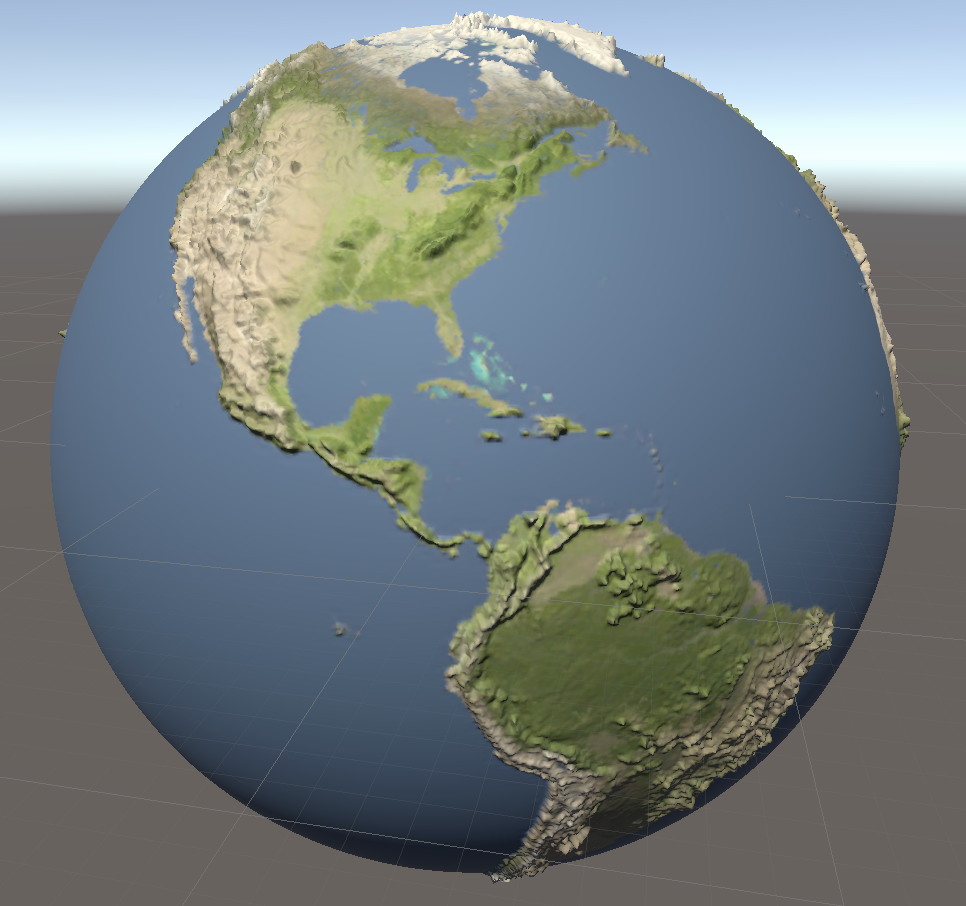

# PlanetMeshTest
 
The project was created in Unity 2020.3.32f1.

The final implementation is currently in Scene - DemoForClass.

There are 2 main objects in the scene:

* PlayerShip
    * Hull
    * Camera
* Sun
    * SunLight
    * Planets

The ship is what the player controls. Controls are WASD and EQ for moving and turning. Space to fly forward.

The Sun is a unity sphere with a sun texture on it and is not generated. It contains a Solar System script for finding planet children and rotating them around naiively in a circle. It also has a light source for the environment as if it was a sun. The Solar System script also has controls of - for preloading the scene and = for loading it again, to see a new Solar System with new planets.

The planets are the main generated items for this project. The planets have a MapList item attached, which are script assets preset for different ranges of output. Detail has to do with how many colors to generate, more being a better amount of color detail. The Palette and Noise will come with the MapList on load, and initialize will choose randomly from this list. Palette is the color scheme options and Noise is the mesh generation options.

Current generation should be set to the level of detail you want for that planet (6 being a good median value). Output Name is the location of the meshes that were generated. It will regenerate if they dont exist, which could take awhile and makes a 120mb files for generation 8 (x4 each step), so it is set to max 7 generations.

Printout map will give an image of the heightmap and colormap output into resources.

Hit play and everything should work, if it is all setup as stated above! Following are some outputs the generator can create:

This is an example of an earth and moon heightmap/colormap placed on the mesh.

